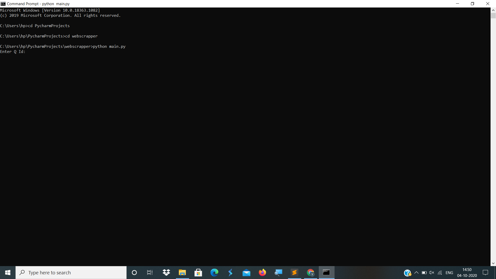
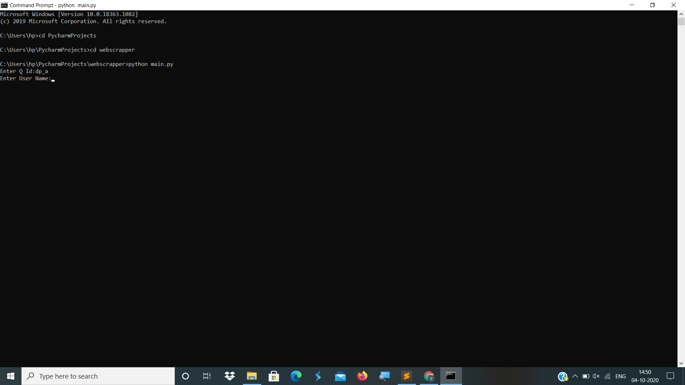
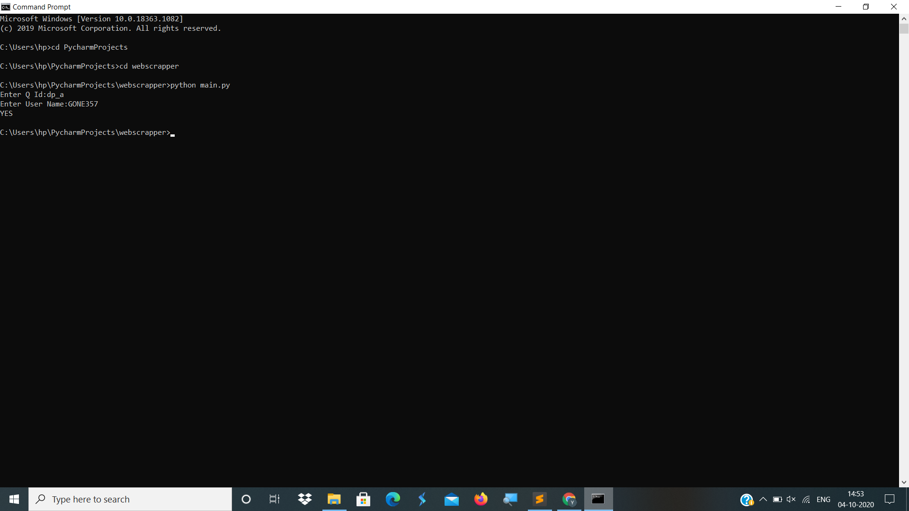

# web_Scraping
This Project is used to extract the web content of an Coding platform of a particular user that whether he/she done that question or not. 
* Open a Command Terminal and run this python script. 
  > * python main.py
* After this you will get a window like this-

* Enter Question Id. 

* Enter User name. 

* If that user is done with that que you will get YES as an ans and NO otherwise.

